# OpenClaw 源码运行机制详解

## 目录

1. [整体架构概览](#1-整体架构概览)
2. [启动流程](#2-启动流程)
3. [核心模块详解](#3-核心模块详解)
4. [数据流向](#4-数据流向)
5. [插件系统](#5-插件系统)
6. [通道系统](#6-通道系统)
7. [代理系统](#7-代理系统)
8. [网关协议](#8-网关协议)
9. [安全机制](#9-安全机制)
10. [配置系统](#10-配置系统)

---

## 1. 整体架构概览

OpenClaw 是一个模块化的 AI 代理平台，采用分层架构设计：

```
┌─────────────────────────────────────────────────────────────────────────┐
│                           用户界面层 (UI Layer)                          │
│  ┌─────────────┐  ┌─────────────┐  ┌─────────────┐  ┌─────────────┐    │
│  │   TUI CLI   │  │ Control UI  │  │  Mobile App │  │  Web Chat   │    │
│  └─────────────┘  └─────────────┘  └─────────────┘  └─────────────┘    │
└─────────────────────────────────────────────────────────────────────────┘
                                    │
                                    ▼
┌─────────────────────────────────────────────────────────────────────────┐
│                          网关层 (Gateway Layer)                          │
│  ┌─────────────┐  ┌─────────────┐  ┌─────────────┐  ┌─────────────┐    │
│  │ HTTP Server │  │ WS Server   │  │ Auth Module │  │ RPC Methods │    │
│  └─────────────┘  └─────────────┘  └─────────────┘  └─────────────┘    │
└─────────────────────────────────────────────────────────────────────────┘
                                    │
                                    ▼
┌─────────────────────────────────────────────────────────────────────────┐
│                          代理层 (Agent Layer)                            │
│  ┌─────────────┐  ┌─────────────┐  ┌─────────────┐  ┌─────────────┐    │
│  │ Agent Run   │  │ Tool System │  │ Context Eng │  │ Memory Sys  │    │
│  └─────────────┘  └─────────────┘  └─────────────┘  └─────────────┘    │
└─────────────────────────────────────────────────────────────────────────┘
                                    │
                                    ▼
┌─────────────────────────────────────────────────────────────────────────┐
│                        提供者层 (Provider Layer)                         │
│  ┌─────────────┐  ┌─────────────┐  ┌─────────────┐  ┌─────────────┐    │
│  │  Anthropic  │  │   OpenAI    │  │   Gemini    │  │   Others    │    │
│  └─────────────┘  └─────────────┘  └─────────────┘  └─────────────┘    │
└─────────────────────────────────────────────────────────────────────────┘
                                    │
                                    ▼
┌─────────────────────────────────────────────────────────────────────────┐
│                        通道层 (Channel Layer)                            │
│  ┌─────────────┐  ┌─────────────┐  ┌─────────────┐  ┌─────────────┐    │
│  │   Discord   │  │   Slack     │  │  Telegram   │  │  WhatsApp   │    │
│  └─────────────┘  └─────────────┘  └─────────────┘  └─────────────┘    │
└─────────────────────────────────────────────────────────────────────────┘
```

### 架构图 (Mermaid)

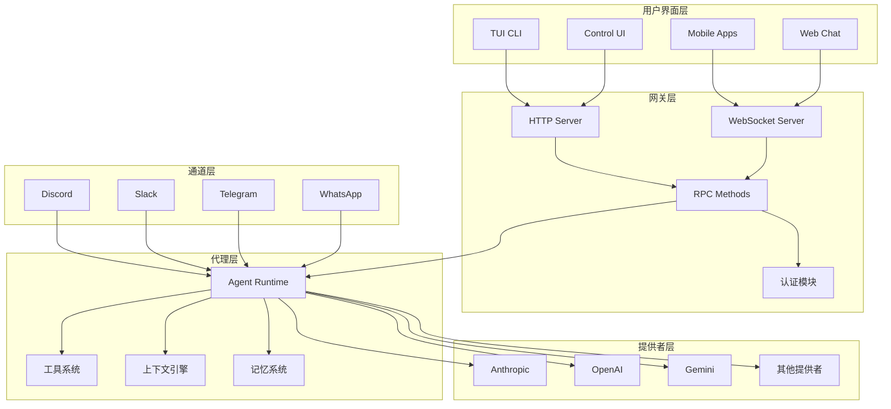
```mermaid
graph TB
    subgraph "用户界面层"
        TUI[TUI CLI]
        CUI[Control UI]
        MOB[Mobile Apps]
        WEB[Web Chat]
    end

    subgraph "网关层"
        HTTP[HTTP Server]
        WS[WebSocket Server]
        AUTH[认证模块]
        RPC[RPC Methods]
    end

    subgraph "代理层"
        AGENT[Agent Runtime]
        TOOLS[工具系统]
        CTX[上下文引擎]
        MEM[记忆系统]
    end

    subgraph "提供者层"
        ANT[Anthropic]
        OAI[OpenAI]
        GEM[Gemini]
        OTH[其他提供者]
    end

    subgraph "通道层"
        DIS[Discord]
        SLA[Slack]
        TEL[Telegram]
        WA[WhatsApp]
    end

    TUI --> HTTP
    CUI --> HTTP
    MOB --> WS
    WEB --> WS

    HTTP --> RPC
    WS --> RPC
    RPC --> AUTH
    RPC --> AGENT

    AGENT --> TOOLS
    AGENT --> CTX
    AGENT --> MEM

    AGENT --> ANT
    AGENT --> OAI
    AGENT --> GEM
    AGENT --> OTH

    DIS --> AGENT
    SLA --> AGENT
    TEL --> AGENT
    WA --> AGENT
```

---

## 2. 启动流程

### 2.1 入口点分析

OpenClaw 的启动入口位于 `src/entry.ts`：

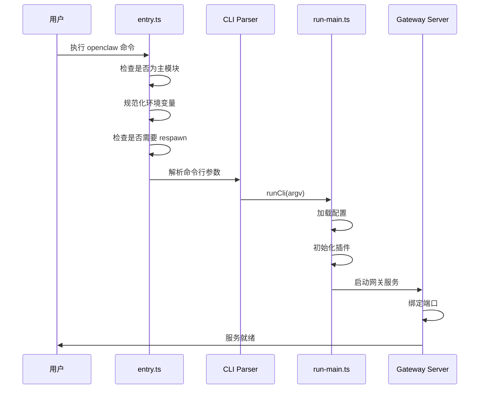
```mermaid
sequenceDiagram
    participant User as 用户
    participant Entry as entry.ts
    participant CLI as CLI Parser
    participant Main as run-main.ts
    participant Gateway as Gateway Server

    User->>Entry: 执行 openclaw 命令
    Entry->>Entry: 检查是否为主模块
    Entry->>Entry: 规范化环境变量
    Entry->>Entry: 检查是否需要 respawn
    Entry->>CLI: 解析命令行参数
    CLI->>Main: runCli(argv)
    Main->>Main: 加载配置
    Main->>Main: 初始化插件
    Main->>Gateway: 启动网关服务
    Gateway->>Gateway: 绑定端口
    Gateway->>User: 服务就绪
```

### 2.2 启动阶段详解

#### 阶段一：入口初始化 (`src/entry.ts`)

```typescript
// 1. 设置进程标题
process.title = "openclaw";

// 2. 确保 OpenClaw 执行标记
ensureOpenClawExecMarkerOnProcess();

// 3. 安装进程警告过滤器
installProcessWarningFilter();

// 4. 规范化环境变量
normalizeEnv();

// 5. 启用编译缓存
enableCompileCache();
```

#### 阶段二：CLI 解析 (`src/cli/run-main.ts`)

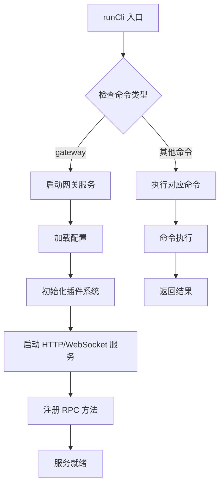
```mermaid
flowchart TD
    A[runCli 入口] --> B{检查命令类型}
    B -->|gateway| C[启动网关服务]
    B -->|其他命令| D[执行对应命令]

    C --> E[加载配置]
    E --> F[初始化插件系统]
    F --> G[启动 HTTP/WebSocket 服务]
    G --> H[注册 RPC 方法]
    H --> I[服务就绪]

    D --> J[命令执行]
    J --> K[返回结果]
```

#### 阶段三：网关启动 (`src/gateway/server.ts`)

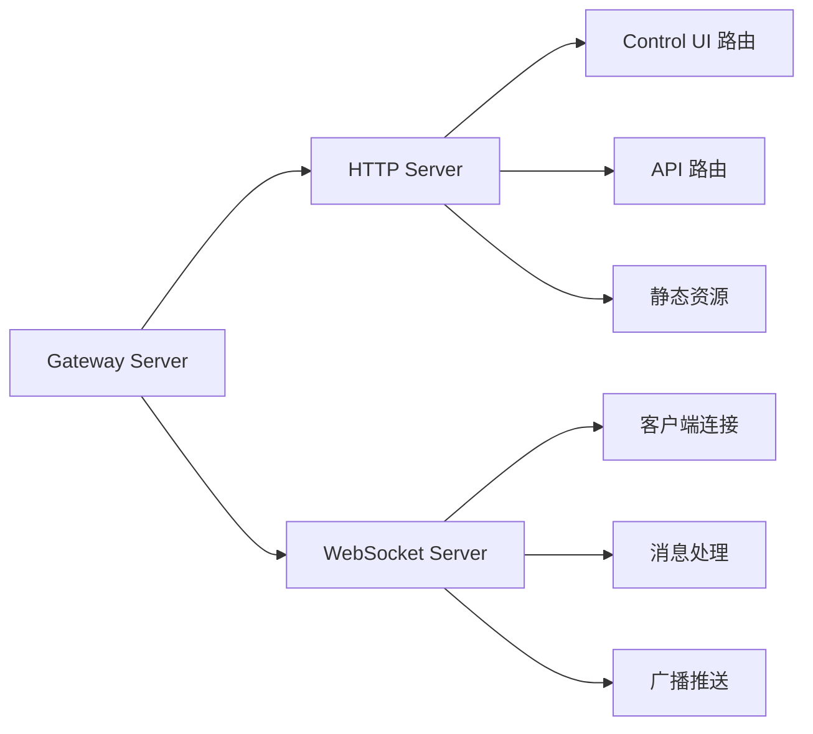
```mermaid
flowchart LR
    A[Gateway Server] --> B[HTTP Server]
    A --> C[WebSocket Server]

    B --> D[Control UI 路由]
    B --> E[API 路由]
    B --> F[静态资源]

    C --> G[客户端连接]
    C --> H[消息处理]
    C --> I[广播推送]
```

---

## 3. 核心模块详解

### 3.1 模块目录结构

```
src/
├── entry.ts              # 主入口
├── cli/                  # CLI 命令处理
│   ├── run-main.ts       # CLI 主运行逻辑
│   ├── program/          # Commander 命令定义
│   └── argv*.ts          # 参数解析
├── gateway/              # 网关服务
│   ├── server*.ts        # 服务器实现
│   ├── auth*.ts          # 认证模块
│   ├── protocol/         # 协议定义
│   └── server-methods/   # RPC 方法
├── agents/               # 代理运行时
│   ├── agent-*.ts        # 代理核心逻辑
│   ├── tools/            # 工具系统
│   └── context/          # 上下文管理
├── channels/             # 通道实现
│   ├── discord/
│   ├── slack/
│   ├── telegram/
│   └── whatsapp/
├── plugins/              # 插件系统
├── plugin-sdk/           # 插件 SDK
├── config/               # 配置系统
├── security/             # 安全模块
└── memory/               # 记忆系统
```

### 3.2 核心模块职责

| 模块 | 路径 | 职责 |
|------|------|------|
| **CLI** | `src/cli/` | 命令行解析、命令路由、用户交互 |
| **Gateway** | `src/gateway/` | HTTP/WebSocket 服务、认证、RPC 方法 |
| **Agents** | `src/agents/` | AI 代理运行时、工具调用、上下文管理 |
| **Channels** | `src/channels/` | 消息通道实现（Discord、Slack 等） |
| **Plugins** | `src/plugins/` | 插件加载、注册、生命周期管理 |
| **Config** | `src/config/` | 配置加载、验证、热重载 |
| **Security** | `src/security/` | SSRF 防护、路径验证、权限控制 |
| **Memory** | `src/memory/` | 短期/长期记忆、向量搜索 |

---

## 4. 数据流向

### 4.1 消息处理流程

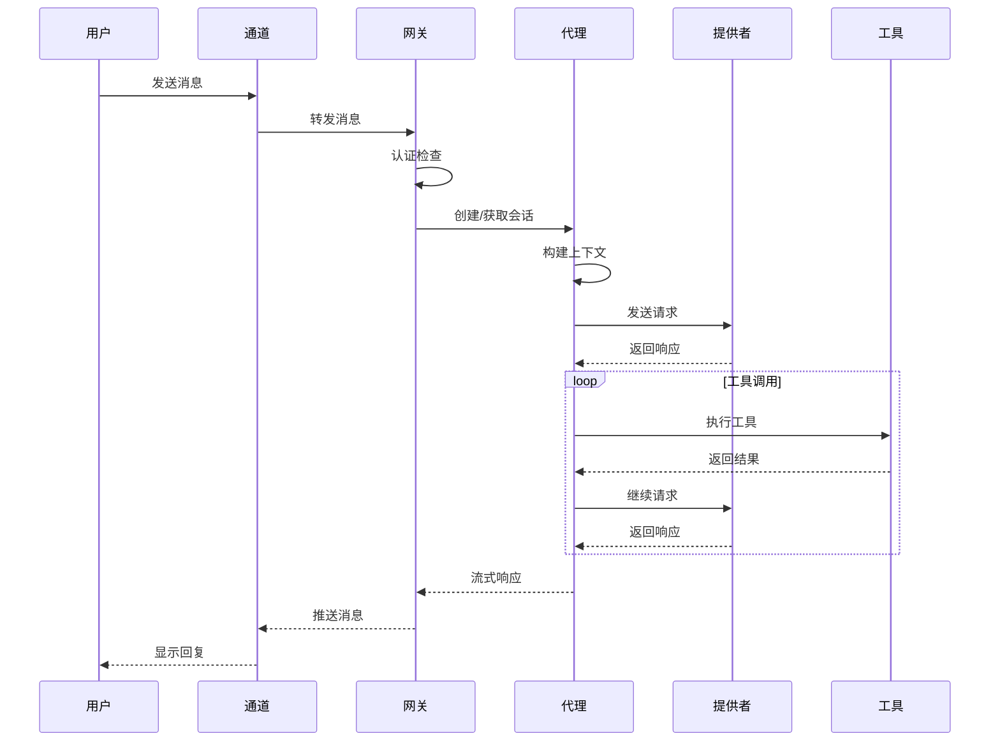
```mermaid
sequenceDiagram
    participant User as 用户
    participant Channel as 通道
    participant Gateway as 网关
    participant Agent as 代理
    participant Provider as 提供者
    participant Tools as 工具

    User->>Channel: 发送消息
    Channel->>Gateway: 转发消息
    Gateway->>Gateway: 认证检查
    Gateway->>Agent: 创建/获取会话
    Agent->>Agent: 构建上下文
    Agent->>Provider: 发送请求
    Provider-->>Agent: 返回响应

    loop 工具调用
        Agent->>Tools: 执行工具
        Tools-->>Agent: 返回结果
        Agent->>Provider: 继续请求
        Provider-->>Agent: 返回响应
    end

    Agent-->>Gateway: 流式响应
    Gateway-->>Channel: 推送消息
    Channel-->>User: 显示回复
```

### 4.2 请求处理管道

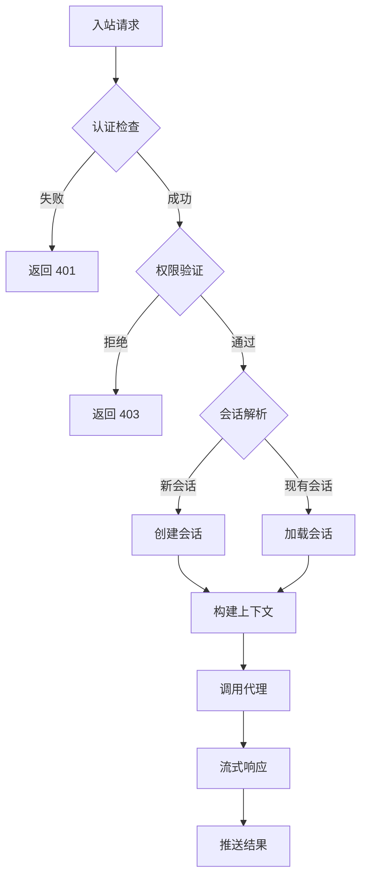
```mermaid
flowchart TD
    A[入站请求] --> B{认证检查}
    B -->|失败| C[返回 401]
    B -->|成功| D{权限验证}
    D -->|拒绝| E[返回 403]
    D -->|通过| F{会话解析}
    F -->|新会话| G[创建会话]
    F -->|现有会话| H[加载会话]
    G --> I[构建上下文]
    H --> I
    I --> J[调用代理]
    J --> K[流式响应]
    K --> L[推送结果]
```

---

## 5. 插件系统

### 5.1 插件架构

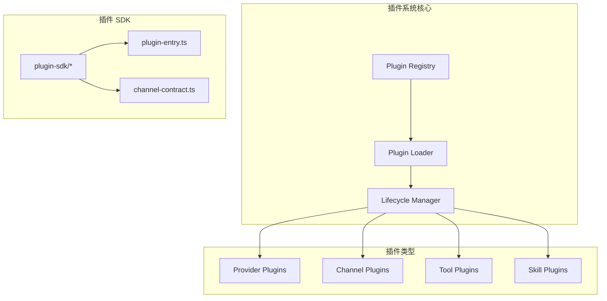
```mermaid
graph TB
    subgraph "插件系统核心"
        REG[Plugin Registry]
        LOAD[Plugin Loader]
        LIFE[Lifecycle Manager]
    end

    subgraph "插件类型"
        PROV[Provider Plugins]
        CHAN[Channel Plugins]
        TOOL[Tool Plugins]
        SKILL[Skill Plugins]
    end

    subgraph "插件 SDK"
        SDK[plugin-sdk/*]
        ENTRY[plugin-entry.ts]
        CONTRACT[channel-contract.ts]
    end

    REG --> LOAD
    LOAD --> LIFE
    LIFE --> PROV
    LIFE --> CHAN
    LIFE --> TOOL
    LIFE --> SKILL

    SDK --> ENTRY
    SDK --> CONTRACT
```

### 5.2 插件生命周期

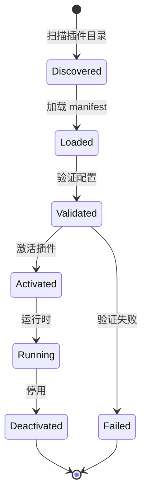
```mermaid
stateDiagram-v2
    [*] --> Discovered: 扫描插件目录
    Discovered --> Loaded: 加载 manifest
    Loaded --> Validated: 验证配置
    Validated --> Activated: 激活插件
    Activated --> Running: 运行时
    Running --> Deactivated: 停用
    Deactivated --> [*]

    Validated --> Failed: 验证失败
    Failed --> [*]
```

### 5.3 插件目录结构

```
extensions/
├── discord/              # Discord 通道插件
│   ├── openclaw.plugin.json
│   ├── src/
│   ├── api.ts
│   └── runtime-api.ts
├── slack/                # Slack 通道插件
├── telegram/             # Telegram 通道插件
├── openai/               # OpenAI 提供者插件
├── anthropic/            # Anthropic 提供者插件
└── memory-core/          # 记忆核心插件
```

### 5.4 插件边界规则

插件系统采用严格的边界隔离设计，确保核心与扩展之间的解耦。

#### 边界架构

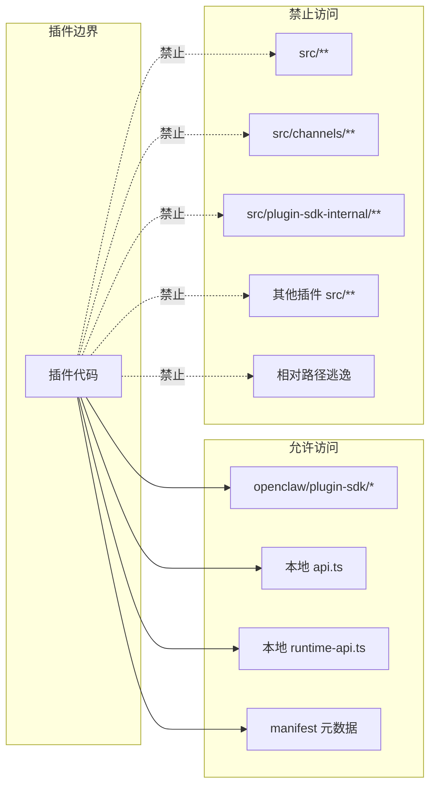
```mermaid
flowchart LR
    subgraph "插件边界"
        A[插件代码]
    end

    subgraph "允许访问"
        B[openclaw/plugin-sdk/*]
        C[本地 api.ts]
        D[本地 runtime-api.ts]
        E[manifest 元数据]
    end

    subgraph "禁止访问"
        F[src/**]
        G[src/channels/**]
        H[src/plugin-sdk-internal/**]
        I[其他插件 src/**]
        J[相对路径逃逸]
    end

    A --> B
    A --> C
    A --> D
    A --> E
    A -.->|禁止| F
    A -.->|禁止| G
    A -.->|禁止| H
    A -.->|禁止| I
    A -.->|禁止| J
```

#### 核心边界原则

| 原则 | 说明 |
|------|------|
| **核心无关性** | 核心代码不能对特定插件 ID 硬编码特殊逻辑，应通过 manifest/registry/能力合约表达 |
| **单向依赖** | 插件只能通过 `openclaw/plugin-sdk/*`、manifest 元数据、注入的运行时助手进入核心 |
| **私有封装** | 插件的 `src/**`、`onboard.ts` 等文件是私有的，除非通过 `api.ts` 显式导出 |
| **无逃逸路径** | 禁止使用相对路径逃逸插件包根目录 |

#### 具体规则

**✅ 插件允许的操作：**
- 从 `openclaw/plugin-sdk/*` 导入公共 API
- 使用本地 `api.ts` 和 `runtime-api.ts` 桶文件
- 通过 manifest 元数据声明能力
- 使用注入的运行时助手

**❌ 插件禁止的操作：**
- 导入核心内部模块 (`src/**`)
- 导入通道内部实现 (`src/channels/**`)
- 导入内部 SDK (`src/plugin-sdk-internal/**`)
- 导入其他插件的源码 (`extensions/*/src/**`)
- 使用逃逸包根的相对路径 (`../../../src/...`)

#### 提供者插件特殊规则

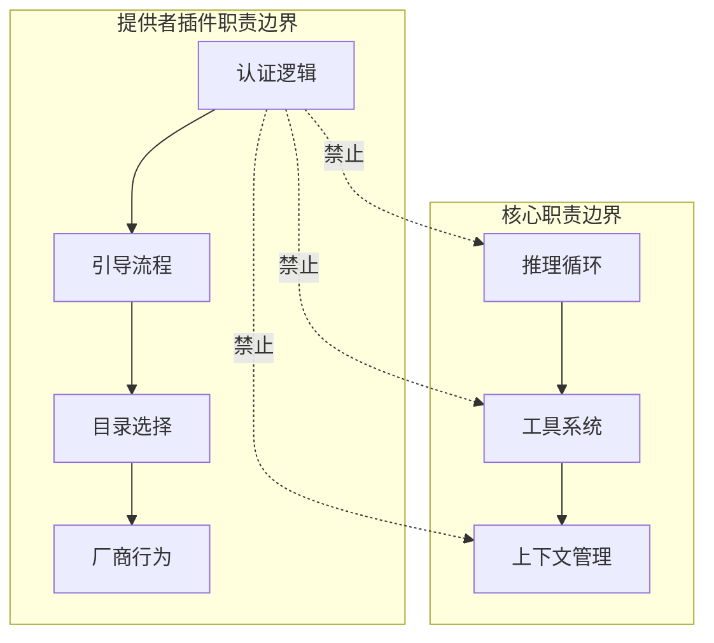
```mermaid
graph TB
    subgraph "提供者插件职责边界"
        AUTH[认证逻辑]
        ONBOARD[引导流程]
        CATALOG[目录选择]
        VENDOR[厂商行为]
    end

    subgraph "核心职责边界"
        LOOP[推理循环]
        TOOLS[工具系统]
        CTX[上下文管理]
    end

    AUTH --> ONBOARD
    ONBOARD --> CATALOG
    CATALOG --> VENDOR

    AUTH -.->|禁止| LOOP
    AUTH -.->|禁止| TOOLS
    AUTH -.->|禁止| CTX

    LOOP --> TOOLS
    TOOLS --> CTX
```

**提供者插件应保留的逻辑：**
- 认证流程和凭证管理
- 用户引导和配置检测
- 模型目录选择
- 厂商特定的产品行为

**不应移入核心：**
- 即使多个提供者看起来相似，也要保留在各自插件中
- 通过共享助手复用逻辑，而不是移入核心

#### 扩展边界流程

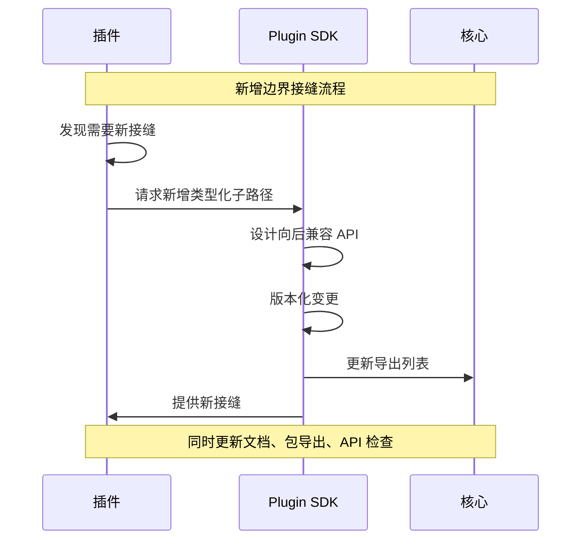
```mermaid
sequenceDiagram
    participant Plugin as 插件
    participant SDK as Plugin SDK
    participant Core as 核心

    Note over Plugin,Core: 新增边界接缝流程

    Plugin->>Plugin: 发现需要新接缝
    Plugin->>SDK: 请求新增类型化子路径
    SDK->>SDK: 设计向后兼容 API
    SDK->>SDK: 版本化变更
    SDK->>Core: 更新导出列表
    SDK->>Plugin: 提供新接缝

    Note over Plugin,Core: 同时更新文档、包导出、API 检查
```

#### 元数据与运行时分离

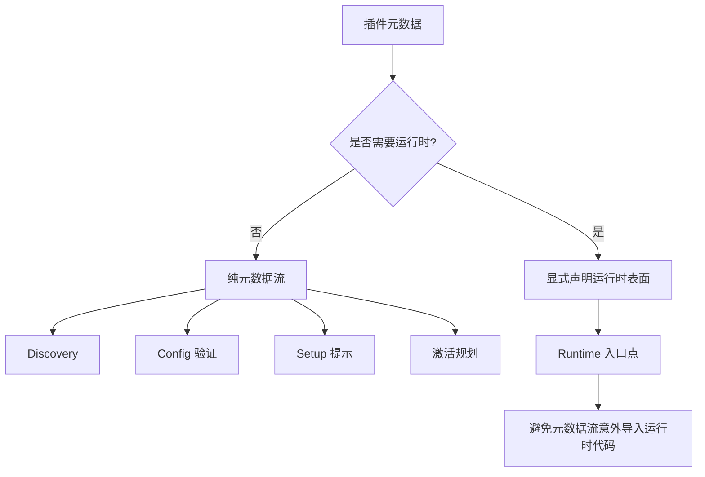
```mermaid
flowchart TD
    A[插件元数据] --> B{是否需要运行时?}
    B -->|否| C[纯元数据流]
    B -->|是| D[显式声明运行时表面]

    C --> E[Discovery]
    C --> F[Config 验证]
    C --> G[Setup 提示]
    C --> H[激活规划]

    D --> I[Runtime 入口点]
    I --> J[避免元数据流意外导入运行时代码]
```

#### 反模式警示

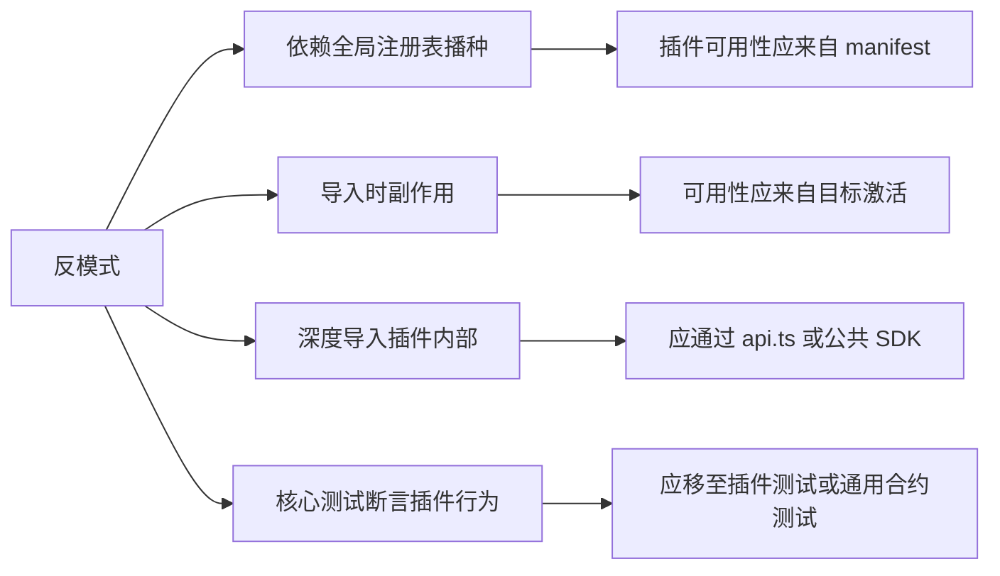
```mermaid
graph LR
    A[反模式] --> B[依赖全局注册表播种]
    A --> C[导入时副作用]
    A --> D[深度导入插件内部]
    A --> E[核心测试断言插件行为]

    B --> F[插件可用性应来自 manifest]
    C --> G[可用性应来自目标激活]
    D --> H[应通过 api.ts 或公共 SDK]
    E --> I[应移至插件测试或通用合约测试]
```

#### 快速路径设计

当核心需要在热路径上访问插件拥有的静态数据时：

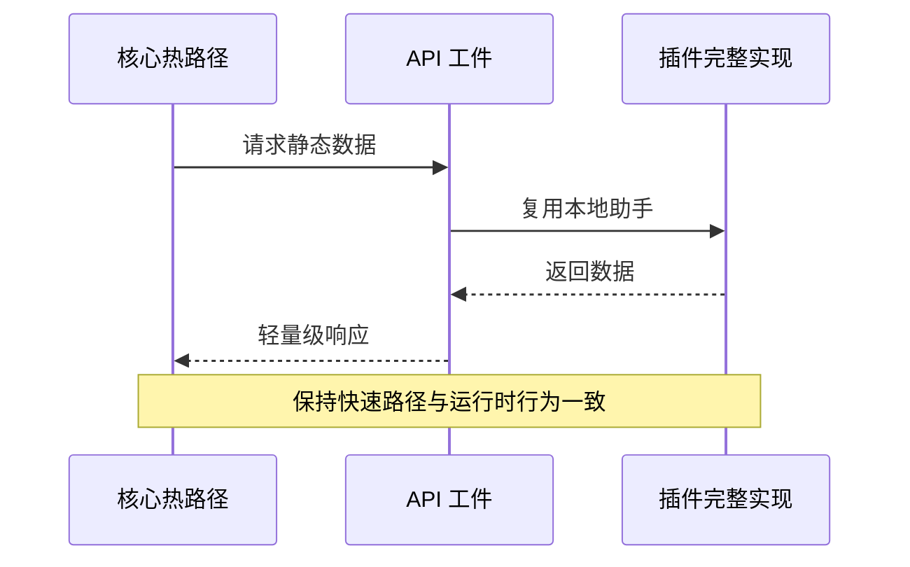
```mermaid
sequenceDiagram
    participant Core as 核心热路径
    participant API as API 工件
    participant Plugin as 插件完整实现

    Core->>API: 请求静态数据
    API->>Plugin: 复用本地助手
    Plugin-->>API: 返回数据
    API-->>Core: 轻量级响应

    Note over Core,Plugin: 保持快速路径与运行时行为一致
```

**示例轻量级工件：**
- `gateway-auth-api.ts`
- `message-tool-api.ts`
- 其他窄接口命名格式: `*-api.ts`

这种边界设计确保了：
1. **可维护性**：核心与插件清晰分离
2. **可扩展性**：第三方插件拥有稳定接口
3. **安全性**：没有隐藏的绕过路径
4. **性能**：快速路径不会偏离运行时行为

---

## 6. 通道系统

### 6.1 通道架构

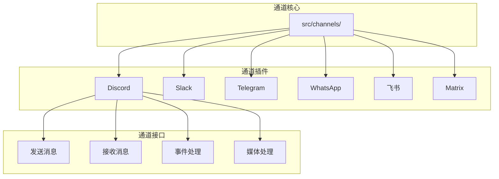
```mermaid
graph TB
    subgraph "通道核心"
        CORE[src/channels/]
    end

    subgraph "通道插件"
        DIS[Discord]
        SLA[Slack]
        TEL[Telegram]
        WA[WhatsApp]
        FEI[飞书]
        MAT[Matrix]
    end

    subgraph "通道接口"
        SEND[发送消息]
        RECV[接收消息]
        EVENT[事件处理]
        MEDIA[媒体处理]
    end

    CORE --> DIS
    CORE --> SLA
    CORE --> TEL
    CORE --> WA
    CORE --> FEI
    CORE --> MAT

    DIS --> SEND
    DIS --> RECV
    DIS --> EVENT
    DIS --> MEDIA
```

### 6.2 消息处理流程

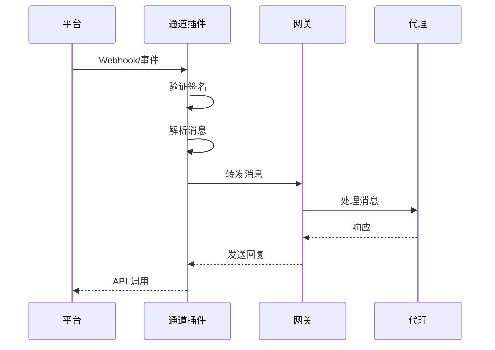
```mermaid
sequenceDiagram
    participant Platform as 平台
    participant Channel as 通道插件
    participant Gateway as 网关
    participant Agent as 代理

    Platform->>Channel: Webhook/事件
    Channel->>Channel: 验证签名
    Channel->>Channel: 解析消息
    Channel->>Gateway: 转发消息
    Gateway->>Agent: 处理消息
    Agent-->>Gateway: 响应
    Gateway-->>Channel: 发送回复
    Channel-->>Platform: API 调用
```

---

## 7. 代理系统

### 7.1 代理运行时架构

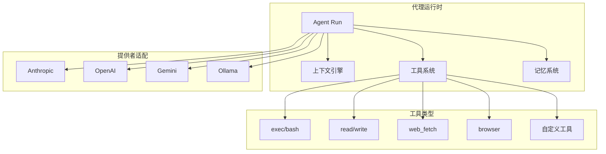
```mermaid
graph TB
    subgraph "代理运行时"
        RUN[Agent Run]
        CTX[上下文引擎]
        TOOL[工具系统]
        MEM[记忆系统]
    end

    subgraph "提供者适配"
        ANT[Anthropic]
        OAI[OpenAI]
        GEM[Gemini]
        OLL[Ollama]
    end

    subgraph "工具类型"
        EXEC[exec/bash]
        READ[read/write]
        WEB[web_fetch]
        BROWSER[browser]
        CUSTOM[自定义工具]
    end

    RUN --> CTX
    RUN --> TOOL
    RUN --> MEM

    RUN --> ANT
    RUN --> OAI
    RUN --> GEM
    RUN --> OLL

    TOOL --> EXEC
    TOOL --> READ
    TOOL --> WEB
    TOOL --> BROWSER
    TOOL --> CUSTOM
```

### 7.2 上下文管理

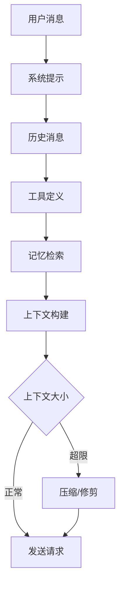
```mermaid
flowchart TD
    A[用户消息] --> B[系统提示]
    B --> C[历史消息]
    C --> D[工具定义]
    D --> E[记忆检索]
    E --> F[上下文构建]
    F --> G{上下文大小}
    G -->|超限| H[压缩/修剪]
    G -->|正常| I[发送请求]
    H --> I
```

### 7.3 工具调用流程

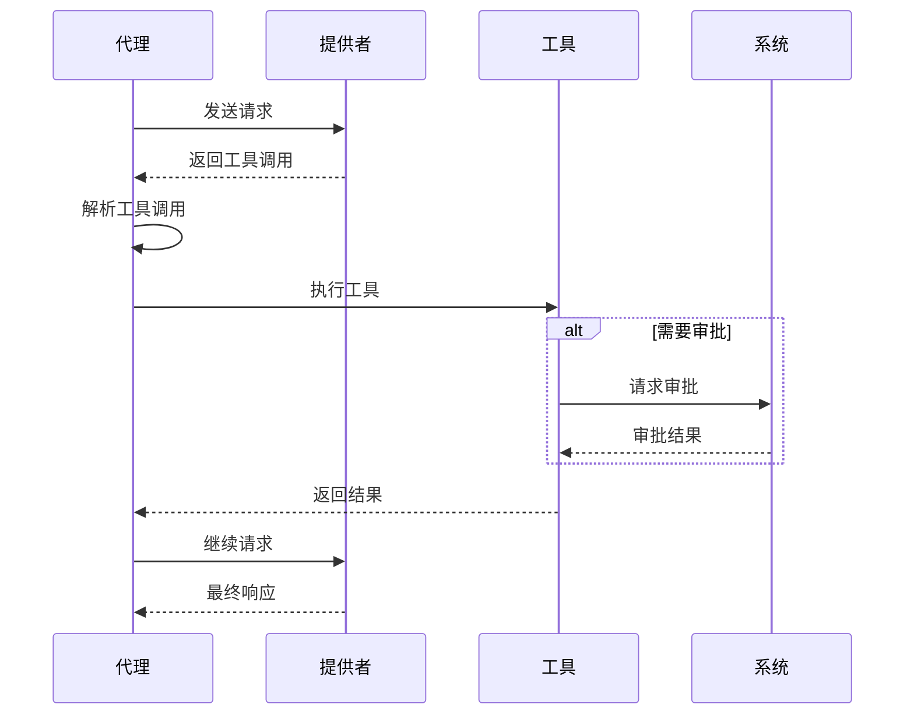
```mermaid
sequenceDiagram
    participant Agent as 代理
    participant Provider as 提供者
    participant Tool as 工具
    participant System as 系统

    Agent->>Provider: 发送请求
    Provider-->>Agent: 返回工具调用
    Agent->>Agent: 解析工具调用
    Agent->>Tool: 执行工具

    alt 需要审批
        Tool->>System: 请求审批
        System-->>Tool: 审批结果
    end

    Tool-->>Agent: 返回结果
    Agent->>Provider: 继续请求
    Provider-->>Agent: 最终响应
```

---

## 8. 网关协议

### 8.1 WebSocket 协议

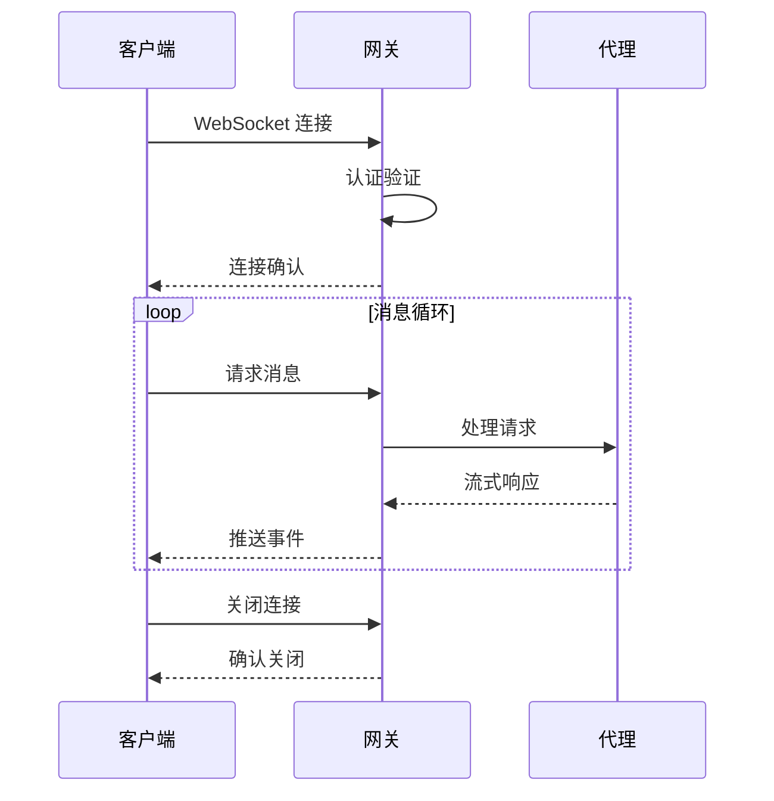
```mermaid
sequenceDiagram
    participant Client as 客户端
    participant Gateway as 网关
    participant Agent as 代理

    Client->>Gateway: WebSocket 连接
    Gateway->>Gateway: 认证验证
    Gateway-->>Client: 连接确认

    loop 消息循环
        Client->>Gateway: 请求消息
        Gateway->>Agent: 处理请求
        Agent-->>Gateway: 流式响应
        Gateway-->>Client: 推送事件
    end

    Client->>Gateway: 关闭连接
    Gateway-->>Client: 确认关闭
```

### 8.2 RPC 方法分类

| 类别 | 方法 | 说明 |
|------|------|------|
| **聊天** | `chat`, `chat.abort` | 消息处理 |
| **会话** | `sessions.list`, `sessions.get` | 会话管理 |
| **模型** | `models.list`, `models.probe` | 模型查询 |
| **配置** | `config.get`, `config.patch` | 配置管理 |
| **工具** | `tools.invoke`, `tools.list` | 工具调用 |
| **审批** | `approvals.get`, `approvals.resolve` | 执行审批 |
| **节点** | `node.invoke`, `node.pair` | 节点管理 |

### 8.3 HTTP API 端点

```
/api/v1/chat              # 聊天 API
/api/v1/models            # 模型列表
/api/v1/tools             # 工具列表
/__openclaw/control-ui/*  # Control UI
/__openclaw/health        # 健康检查
/mcp                      # MCP 端点
```

---

## 9. 安全机制

### 9.1 安全架构

```mermaid
graph TB
    subgraph "认证层"
        AUTH[认证模块]
        TOKEN[令牌验证]
        SESSION[会话管理]
    end

    subgraph "授权层"
        ROLE[角色策略]
        PERM[权限检查]
        ALLOW[允许列表]
    end

    subgraph "防护层"
        SSRF[SSRF 防护]
        PATH[路径验证]
        ENV[环境变量过滤]
        INJECT[注入防护]
    end

    AUTH --> TOKEN
    TOKEN --> SESSION
    SESSION --> ROLE
    ROLE --> PERM
    PERM --> ALLOW

    ALLOW --> SSRF
    SSRF --> PATH
    PATH --> ENV
    ENV --> INJECT
```

### 9.2 SSRF 防护机制

```mermaid
flowchart TD
    A[URL 请求] --> B{协议检查}
    B -->|非 HTTP/S| C[拒绝]
    B -->|HTTP/S| D{DNS 解析}
    D --> E{IP 类型}
    E -->|私有 IP| F{策略检查}
    E -->|公共 IP| G[允许]
    F -->|允许私有网络| G
    F -->|阻止| H[拒绝]
```

### 9.3 环境变量过滤

被阻止的危险环境变量：
- **代理相关**: `HTTP_PROXY`, `HTTPS_PROXY`, `NO_PROXY`
- **Git 相关**: `GIT_DIR`, `GIT_WORK_TREE`, `GIT_INDEX_FILE`
- **云凭证**: `AWS_*`, `GOOGLE_*`, `AZURE_*`
- **编译器**: `CC`, `CXX`, `PYTHONPATH`
- **配置路径**: `CLAUDE_CONFIG_DIR`, `OPENCLAW_CONFIG_DIR`

---

## 10. 配置系统

### 10.1 配置层次

```mermaid
flowchart TD
    A[默认配置] --> B[全局配置]
    B --> C[用户配置]
    C --> D[环境变量]
    D --> E[命令行参数]

    E --> F[最终配置]
```

### 10.2 配置文件位置

```
~/.openclaw/
├── openclaw.json         # 主配置
├── agents/               # 代理配置
│   └── main/
│       ├── agent.json
│       └── auth-profiles.json
├── credentials/          # 凭证存储
└── sessions/             # 会话数据
```

### 10.3 热重载机制

```mermaid
sequenceDiagram
    participant FS as 文件系统
    participant Watch as 监听器
    participant Config as 配置管理
    participant Gateway as 网关

    FS->>Watch: 文件变更
    Watch->>Config: 触发重载
    Config->>Config: 解析配置
    Config->>Config: 验证配置
    Config->>Gateway: 应用变更
    Gateway->>Gateway: 重启服务
```

---

## 附录：关键文件索引

| 功能 | 关键文件 |
|------|----------|
| 入口点 | `src/entry.ts` |
| CLI 主逻辑 | `src/cli/run-main.ts` |
| 网关服务器 | `src/gateway/server.ts` |
| 认证模块 | `src/gateway/auth.ts` |
| 代理运行时 | `src/agents/agent-command.ts` |
| 工具系统 | `src/agents/tools/` |
| 插件加载器 | `src/plugins/loader.ts` |
| 配置管理 | `src/config/` |
| SSRF 防护 | `src/security/ssrf.ts` |
| 通道核心 | `src/channels/` |
| 插件 SDK | `src/plugin-sdk/` |

---

## 总结

OpenClaw 采用模块化、分层架构设计：

1. **入口层**：负责 CLI 解析和启动初始化
2. **网关层**：提供 HTTP/WebSocket 服务和认证
3. **代理层**：管理 AI 代理运行时和工具调用
4. **通道层**：实现各种消息平台的集成
5. **插件层**：提供可扩展的插件系统
6. **安全层**：实现 SSRF 防护、路径验证等安全机制

这种架构使得 OpenClaw 具有良好的可扩展性和可维护性，同时保证了系统的安全性。
